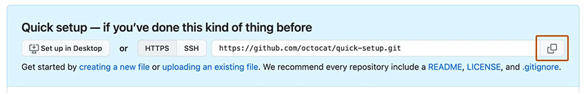

# Revel Digital gadget library for Angular

Angular library for building custom Revel Digital gadgets. This library simplies the player/gadget interface making it easier
to build full featured gadgets utilizing the Angular framework.

## Quickstart

**New to Angular?** [Check out the Angular documentation](https://angular.io/guide/setup-local) for getting your environment configured for development.


### **Step 1.** GitHub Repository Creation (Optional)

**Not hosting your app on Github? Skip to step #2.**

Create a new repository on [GitHub.com](https://github.com/). For more information, see "[Creating a new repository](https://docs.github.com/en/repositories/creating-and-managing-repositories/creating-a-new-repository)."


Copy your remote repository URL



```sh
git remote add origin <REMOTE_URL>
# Sets the new remote
git remote -v
# Verifies the new remote URL
```

### **Step 2.** Create a new Angular app

From within your working folder, run the following Angular CLI command using the name of your app.

```sh
ng new my-app --directory ./
# Generates the boilerplate code for a new Angular app
```

### **Step 3.** Add the Revel Digital libaries

Run the Revel Digital angular schematic which will configure your app for use as a Revel Digital gadget.

```sh
ng add @reveldigital/player-client
# Run the Revel Digital Angular schematic
```

### **Step 4.** Build

The build script will generate the Angular app along with a the gadget XML definition file.

```sh
npm run build:gadget
# Run the gadget build script
```

### **Step 5.** Deploy

The app can be hosted using any number of hosting services, however the provided schematic includes a simplified option for publishing to [GitHub Pages](https://pages.github.com/).

Assuming your working folder is associated with your GitHub repository, simply run the following command to deploy the app to the `gh-pages` branch. The gadget app and associated XML file will be publicly visibile and available for use in your signage.

```sh
npm run deploy:gagdet
# Deploy to GitHub Pages
```

# Documentation

Library documentation is available here: https://reveldigital.github.io/reveldigital-client-library/

A sample Angular app is available in this repo under [projects/test-app](/projects/test-app).
